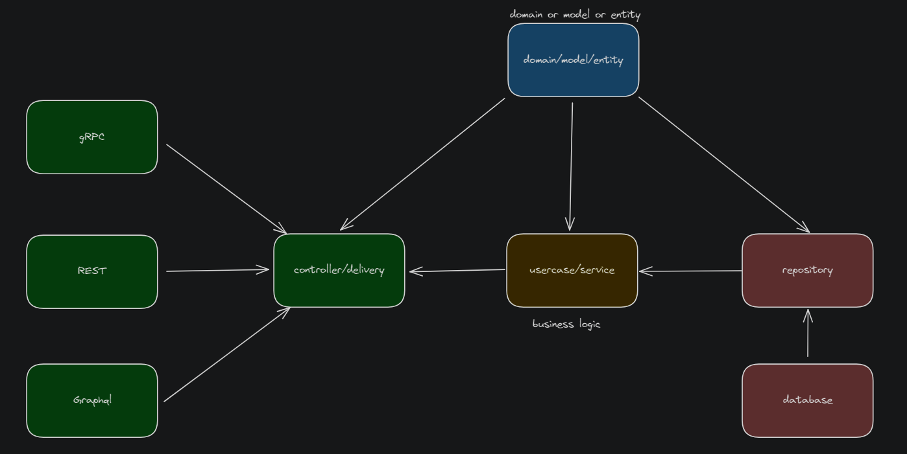
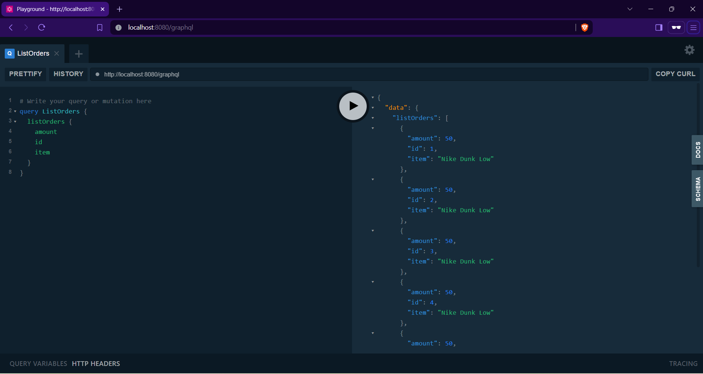
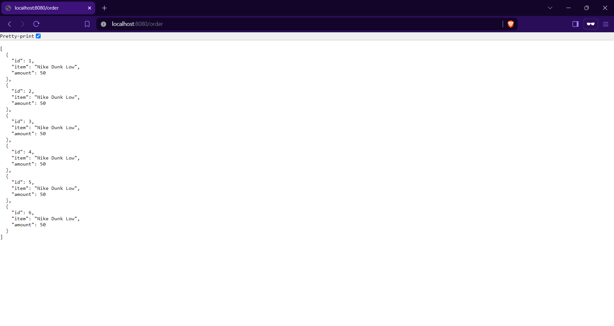
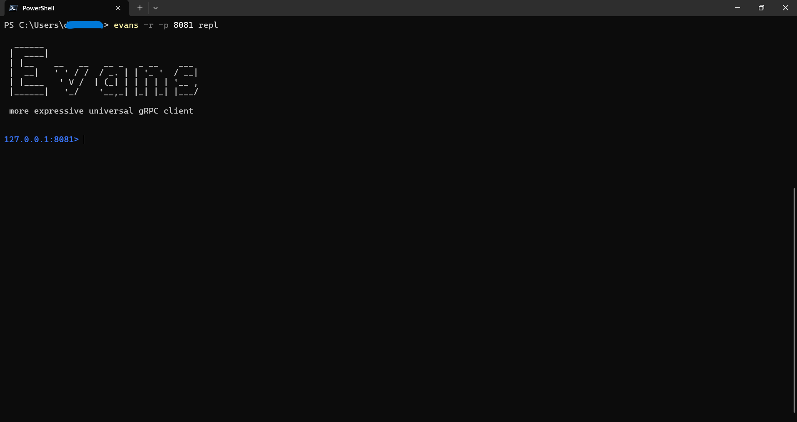
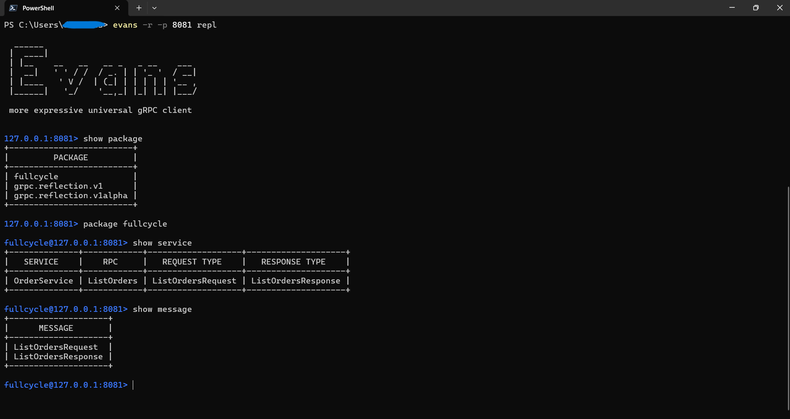

[](https://github.com/dyammarcano/fullcycle_clean_architecture/actions/workflows/ci.yml)

# Desafio Clean Architecture

Olá devs!
Agora é a hora de botar a mão na massa. Para este desafio, você precisará criar o usecase de listagem das orders.
Esta listagem precisa ser feita com:

- Endpoint REST (GET /order)
- Service ListOrders com GRPC
- Query ListOrders GraphQL
  Não esqueça de criar as migrações necessárias e o arquivo api.http com a request para criar e listar as orders.

Para a criação do banco de dados, utilize o Docker (Dockerfile / docker-compose.yaml), com isso ao rodar o comando
docker compose up tudo deverá subir, preparando o banco de dados.
Inclua um README.md com os passos a serem executados no desafio e a porta em que a aplicação deverá responder em cada
serviço.

# Requisitos

- [Docker](https://www.docker.com/)
- [Golang](https://golang.org/) (Opcional)

# Arquitetura do projeto

Consulte também ARCHITECTURE.md para uma análise detalhada da separação das camadas.



```text
github.com/dyammarcano/fullcycle_clean_architecture
├───cmd
├───internal
│   ├───adapter        # Adapters (driving/driven): HTTP, gRPC, GraphQL
│   │   ├───grpc
│   │   └───http
│   ├───domain         # Core domain entities and repository interfaces
│   ├───repository     # Infrastructure implementations of domain ports
│   │   └───migrations
│   └───usecase        # Application services (business rules), depend on domain ports
└───pkg
│   ├───config
│   ├───grpc
│   │   ├───pb
│   │   └───proto
│   ├───logger
│   └───util
├── main.go
├── Dockerfile
├── docker-compose.yaml
└── README.md
```

## Hexagonal (Ports and Adapters) compliance

- Domain owns the Order entity and the OrderRepository port (internal/domain).
- Use cases depend only on the domain port and domain entities (or simple DTOs); no transport/serialization details in use cases.
- Adapters (HTTP, GraphQL, gRPC) depend on use cases and handle serialization/deserialization (JSON, protobuf), translating I/O to domain types.
- Repositories implement the domain port in infrastructure packages (memory, Postgres) and are chosen at composition time.
- Config, logging, and transport details live outside the core and are injected.

Recent small fixes to support this:

- Corrected HTTP JSON helper naming (HelperJSON) and usages for clarity.
- Fixed Postgres repository SQL and scanning to map to domain without leaking infra concerns.
- Moved JSON unmarshalling from use case into HTTP adapter; use cases now accept domain entities.

# Executando o projeto

### NOTA:

Certifique-se de que você tenha o Docker instalado na sua máquina y que o serviço do Docker esteja em execução.

Alen disso, é preciso ter instalada alguma ferramenta para interagir com gRPC, poder ser: 

* [postman](https://www.postman.com/downloads)
* [evans](https://github.com/ktr0731/evans)
* [grpcurl](https://github.com/fullstorydev/grpcurl)

1. Clone o repositório

```bash
$ git clone github.com/dyammarcano/fullcycle_clean_architecture.git
```

2. Acesse a pasta do projeto

```bash
$ cd fullcycle_clean_architecture
```

3. Executar o projeto

```bash
# Comando para gerar as images e subir os containers com o banco de dados
$  docker-compose up --build
```

4. Acesse o endereço [http://localhost:8080/graphql](http://localhost:8080/graphql) para acessar a ‘interface’ do GraphQL Playground



5. Acesse o endereço [http://localhost:8080/order](http://localhost:8080/order) para acessar a ‘interface’ http



6. Acesse o endereço [127.0.0.1:8081](127.0.0.1:8081) para acessar a ‘interface’ do gRPC




# Endpoints

- GraphQL Playground: `http://localhost:8080/graphql`
- gRPC: `http://localhost:8081/`
- REST: `http://localhost:8080/order`

# GraphQL Query

```graphql
query ListOrders {
  listOrders {
    amount
    id
    item
  }
}
```

# gRPC Client

Para testar o gRPC, você pode usar o [evans](https://github.com/ktr0731/evans)

```bash
$ evans -r -p 8081 repl
```

```bash
127.0.0.1:8081> show package
+-------------------------+
|         PACKAGE         |
+-------------------------+
| fullcycle               |
| grpc.reflection.v1      |
| grpc.reflection.v1alpha |
+-------------------------+
```

```bash
127.0.0.1:8081> package fullcycle
```

```bash
fullcycle@127.0.0.1:8081> show service
+--------------+------------+-------------------+--------------------+
|   SERVICE    |    RPC     |   REQUEST TYPE    |   RESPONSE TYPE    |
+--------------+------------+-------------------+--------------------+
| OrderService | ListOrders | ListOrdersRequest | ListOrdersResponse |
+--------------+------------+-------------------+--------------------+
```

```bash
fullcycle@127.0.0.1:8081> show message
+--------------------+
|      MESSAGE       |
+--------------------+
| ListOrdersRequest  |
| ListOrdersResponse |
+--------------------+
```

```bash
fullcycle@127.0.0.1:8081> desc ListOrdersRequest
+-------+------+----------+
| FIELD | TYPE | REPEATED |
+-------+------+----------+
+-------+------+----------+
```

```bash
fullcycle@127.0.0.1:8081> desc ListOrdersResponse
+--------+----------------------+----------+
| FIELD  |         TYPE         | REPEATED |
+--------+----------------------+----------+
| orders | TYPE_MESSAGE (Order) | true     |
+--------+----------------------+----------+
```

```bash
fullcycle@127.0.0.1:8081> service OrderService
```

```bash
fullcycle.OrderService@127.0.0.1:8081> call ListOrders {}
{
  "orders": [
    {
      "amount": 50,
      "id": 1,
      "item": "Nike Dunk Low"
    },
  ...
  ]
}
```
